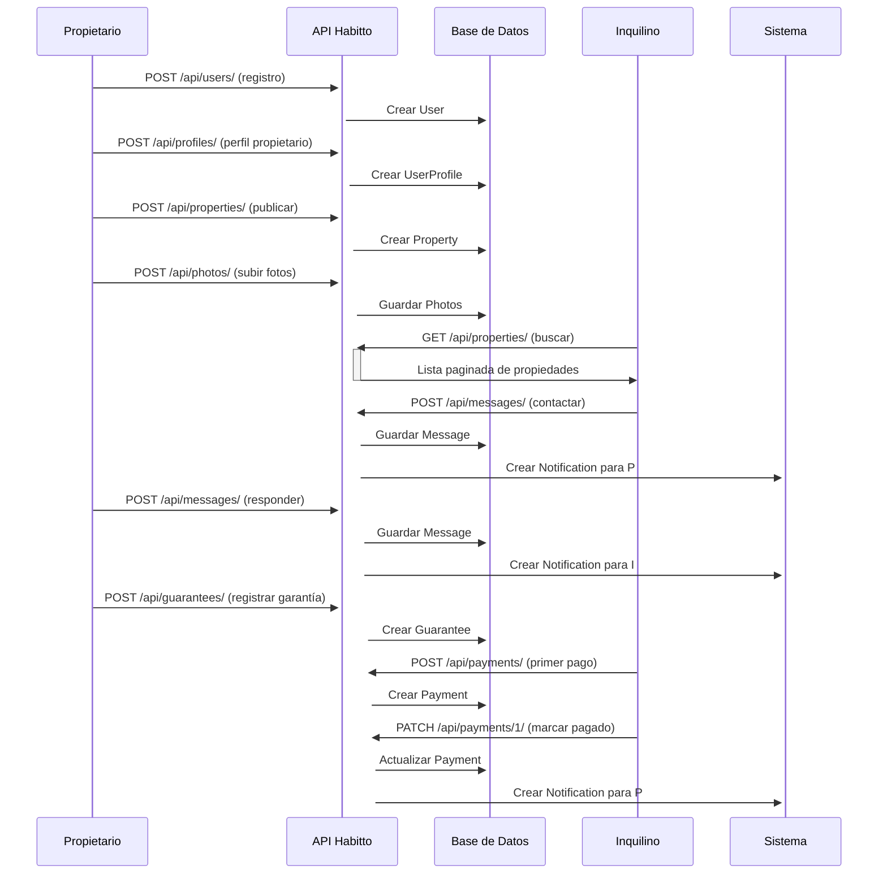
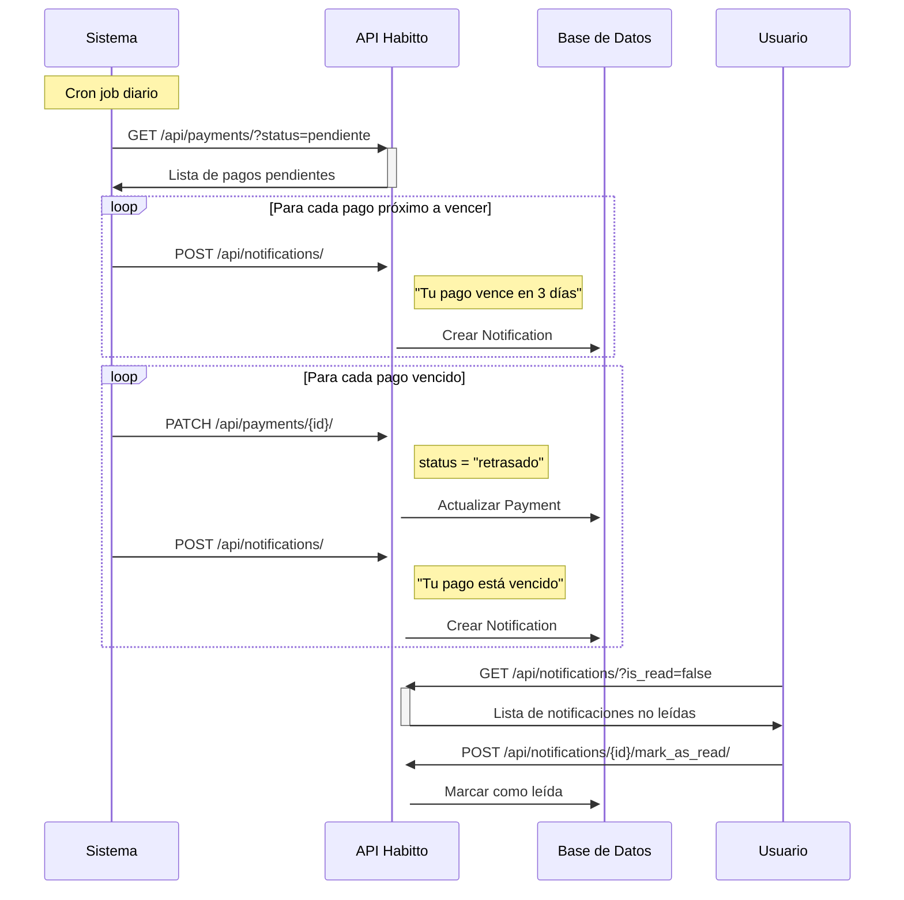
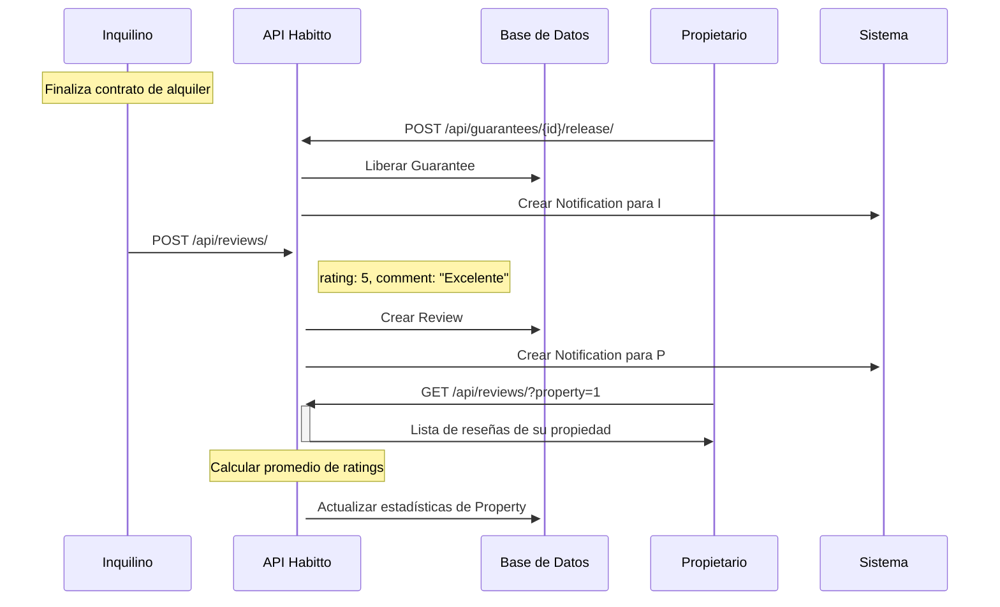

# Flujos de Negocio de Habitto

Este documento describe los principales flujos de negocio y relaciones entre entidades en la plataforma Habitto.

## Arquitectura del Sistema

### Modelos Principales
- **User**: Usuario base de Django (username, email, password, etc.)
- **UserProfile**: Perfil extendido con tipo de usuario y preferencias
- **Property**: Propiedades inmobiliarias
- **Photo**: Fotos de propiedades
- **Amenity**: Amenidades disponibles
- **Review**: Reseñas de propiedades
- **Message**: Mensajes entre usuarios
- **Notification**: Notificaciones del sistema
- **Payment**: Pagos de alquileres
- **PaymentMethod**: Métodos de pago disponibles
- **Guarantee**: Garantías de depósito
- **Incentive**: Incentivos económicos

### Tipos de Usuario (UserProfile)
- **inquilino**: Busca y alquila propiedades
- **propietario**: Publica y administra propiedades
- **agente**: Gestiona propiedades de terceros

## Flujos Principales

### 1. Registro y Verificación de Usuario

#### 1.1 Registro Completo
```http
# Paso 1: Crear usuario base
POST /api/users/
{
  "username": "juan_perez",
  "email": "juan@example.com",
  "password": "mi_password_segura",
  "first_name": "Juan",
  "last_name": "Pérez"
}

# Respuesta: Usuario creado con ID
{
  "id": 1,
  "username": "juan_perez",
  "email": "juan@example.com",
  "first_name": "Juan",
  "last_name": "Pérez",
  "date_joined": "2025-10-22T10:00:00Z"
}
```

```http
# Paso 2: Obtener token de autenticación
POST /api/login/
{
  "username": "juan_perez",
  "password": "mi_password_segura"
}

# Respuesta: Tokens JWT
{
  "refresh": "eyJ0eXAiOiJKV1QiLCJhbGciOiJIUzI1NiJ9...",
  "access": "eyJ0eXAiOiJKV1QiLCJhbGciOiJIUzI1NiJ9..."
}
```

```http
# Paso 3: Crear perfil de usuario (con token)
POST /api/profiles/
Authorization: Bearer <access_token>
{
  "user_type": "propietario",
  "phone": "+59112345678",
  "favorites": []
}

# Respuesta: Perfil creado
{
  "id": 1,
  "user": { "id": 1, "username": "juan_perez", ... },
  "user_type": "propietario",
  "phone": "+59112345678",
  "is_verified": false,
  "created_at": "2025-10-22T10:00:00Z",
  "favorites": []
}
```

#### 1.2 Verificación de Perfil (Administrador)
```http
POST /api/profiles/1/verify/
Authorization: Bearer <admin_token>

# Respuesta
{
  "status": "verified"
}
```

### 2. Gestión de Propiedades

#### 2.1 Publicación Completa de Propiedad

```http
# Paso 1: Crear propiedad base
POST /api/properties/
Authorization: Bearer <propietario_token>
{
  "owner": 1,
  "agent": null,
  "type": "casa",
  "address": "Calle Principal 123, Zona Sur, La Paz",
  "latitude": "-16.500000",
  "longitude": "-68.150000",
  "price": "1200.00",
  "guarantee": "1200.00",
  "description": "Casa amplia de 3 dormitorios en zona residencial tranquila",
  "size": 150.5,
  "bedrooms": 3,
  "bathrooms": 2,
  "amenities": [1, 2, 3],
  "availability_date": "2025-11-01",
  "accepted_payment_methods": [1, 2]
}

# Respuesta: Propiedad creada
{
  "id": 1,
  "owner": 1,
  "agent": null,
  "type": "casa",
  "address": "Calle Principal 123, Zona Sur, La Paz",
  "latitude": "-16.500000",
  "longitude": "-68.150000",
  "price": "1200.00",
  "guarantee": "1200.00",
  "description": "Casa amplia de 3 dormitorios en zona residencial tranquila",
  "size": 150.5,
  "bedrooms": 3,
  "bathrooms": 2,
  "amenities": [1, 2, 3],
  "availability_date": "2025-11-01",
  "is_active": true,
  "created_at": "2025-10-22T10:00:00Z",
  "updated_at": "2025-10-22T10:00:00Z",
  "accepted_payment_methods": [1, 2]
}
```

```http
# Paso 2: Subir fotos (múltiples llamadas)
POST /api/photos/
Authorization: Bearer <propietario_token>
Content-Type: multipart/form-data

property=1
image=[archivo_fachada.jpg]
caption=Fachada principal de la casa

# Respuesta por cada foto
{
  "id": 1,
  "property": 1,
  "image": "http://localhost:8000/media/properties/fachada.jpg",
  "caption": "Fachada principal de la casa",
  "created_at": "2025-10-22T10:05:00Z"
}
```

```http
# Paso 3: Actualizar amenidades si es necesario
PATCH /api/properties/1/
Authorization: Bearer <propietario_token>
{
  "amenities": [1, 2, 3, 4, 5]
}
```

#### 2.2 Búsqueda y Exploración de Propiedades

```http
# Búsqueda con filtros múltiples
GET /api/properties/?type=casa&is_active=true&search=zona%20sur&ordering=-created_at&page=1
Authorization: Bearer <inquilino_token>

# Respuesta paginada
{
  "count": 15,
  "next": "http://localhost:8000/api/properties/?page=2&type=casa",
  "previous": null,
  "results": [
    {
      "id": 1,
      "owner": 1,
      "type": "casa",
      "address": "Calle Principal 123, Zona Sur, La Paz",
      "price": "1200.00",
      "bedrooms": 3,
      "bathrooms": 2,
      "amenities": [1, 2, 3],
      "is_active": true,
      "created_at": "2025-10-22T10:00:00Z"
    }
  ]
}
```

```http
# Ver detalles completos de una propiedad
GET /api/properties/1/
Authorization: Bearer <inquilino_token>

# Respuesta: Detalles completos de la propiedad
```

```http
# Ver fotos de la propiedad
GET /api/photos/?property=1
Authorization: Bearer <inquilino_token>

# Respuesta: Lista de fotos de la propiedad
```

```http
# Agregar a favoritos
PATCH /api/profiles/1/
Authorization: Bearer <inquilino_token>
{
  "favorites": [1, 2, 3]
}
```

### 3. Proceso de Alquiler

#### 3.1 Contacto e Inicio de Negociación

```http
# Paso 1: Inquilino contacta al propietario
POST /api/messages/
Authorization: Bearer <inquilino_token>
{
  "sender": 2,
  "receiver": 1,
  "content": "Hola, estoy muy interesado en tu propiedad en Calle Principal 123. ¿Podríamos coordinar una visita?"
}

# Respuesta: Mensaje enviado
{
  "id": 1,
  "sender": 2,
  "receiver": 1,
  "content": "Hola, estoy muy interesado en tu propiedad en Calle Principal 123. ¿Podríamos coordinar una visita?",
  "created_at": "2025-10-22T10:00:00Z"
}
```

```http
# Paso 2: Propietario responde
POST /api/messages/
Authorization: Bearer <propietario_token>
{
  "sender": 1,
  "receiver": 2,
  "content": "¡Hola! Claro, podemos coordinar una visita. ¿Te parece bien mañana a las 3 PM?"
}
```

#### 3.2 Formalización del Alquiler

```http
# Paso 1: Registro de garantía
POST /api/guarantees/
Authorization: Bearer <propietario_token>
{
  "property": 1,
  "tenant": 2,
  "amount": "1200.00"
}

# Respuesta: Garantía registrada
{
  "id": 1,
  "property": 1,
  "tenant": 2,
  "amount": "1200.00",
  "is_released": false,
  "release_date": null,
  "created_at": "2025-10-22T10:00:00Z"
}
```

```http
# Paso 2: Registro del primer pago
POST /api/payments/
Authorization: Bearer <inquilino_token>
{
  "property": 1,
  "tenant": 2,
  "amount": "1200.00",
  "due_date": "2025-11-01",
  "method": 1
}

# Respuesta: Pago registrado
{
  "id": 1,
  "property": 1,
  "tenant": 2,
  "amount": "1200.00",
  "status": "pendiente",
  "due_date": "2025-11-01",
  "paid_date": null,
  "fine": "0.00",
  "method": 1,
  "created_at": "2025-10-22T10:00:00Z"
}
```

#### 3.3 Gestión Mensual del Alquiler

```http
# Consultar pagos pendientes
GET /api/payments/?property=1&tenant=2&status=pendiente
Authorization: Bearer <inquilino_token>

# Respuesta: Lista de pagos pendientes
{
  "count": 1,
  "results": [
    {
      "id": 1,
      "property": 1,
      "tenant": 2,
      "amount": "1200.00",
      "status": "pendiente",
      "due_date": "2025-11-01",
      "method": 1
    }
  ]
}
```

```http
# Marcar pago como realizado
PATCH /api/payments/1/
Authorization: Bearer <inquilino_token>
{
  "status": "pagado",
  "paid_date": "2025-10-30"
}
```

```http
# Crear pago del siguiente mes
POST /api/payments/
Authorization: Bearer <inquilino_token>
{
  "property": 1,
  "tenant": 2,
  "amount": "1200.00",
  "due_date": "2025-12-01",
  "method": 1
}
```

```http
# Reportar problemas o consultas
POST /api/messages/
Authorization: Bearer <inquilino_token>
{
  "sender": 2,
  "receiver": 1,
  "content": "Hola, hay un problema con la calefacción del baño principal. ¿Podrías revisar?"
}
```

#### 3.4 Finalización del Alquiler

```http
# Paso 1: Propietario libera la garantía
POST /api/guarantees/1/release/
Authorization: Bearer <propietario_token>

# Respuesta: Garantía liberada
{
  "status": "guarantee released"
}
```

```http
# Paso 2: Inquilino deja reseña
POST /api/reviews/
Authorization: Bearer <inquilino_token>
{
  "property": 1,
  "user": 2,
  "rating": 5,
  "comment": "Excelente experiencia de alquiler. La propiedad estaba en perfectas condiciones y el propietario fue muy atento."
}

# Respuesta: Reseña creada
{
  "id": 1,
  "property": 1,
  "user": 2,
  "rating": 5,
  "comment": "Excelente experiencia de alquiler. La propiedad estaba en perfectas condiciones y el propietario fue muy atento.",
  "created_at": "2025-10-22T10:00:00Z"
}
```

```http
# Paso 3: Desactivar propiedad si es necesario
PATCH /api/properties/1/
Authorization: Bearer <propietario_token>
{
  "is_active": false
}
```

### 4. Sistema de Notificaciones

#### 4.1 Tipos de Notificaciones del Sistema
- **Mensajes**: Nuevo mensaje recibido
- **Pagos**: Pago próximo a vencer (3 días antes)
- **Pagos**: Pago vencido
- **Garantías**: Garantía liberada
- **Propiedades**: Propiedad favorita actualizada
- **Reseñas**: Nueva reseña en tu propiedad
- **Sistema**: Perfil verificado

#### 4.2 Gestión de Notificaciones

```http
# Ver todas las notificaciones del usuario
GET /api/notifications/?user=1&is_read=false
Authorization: Bearer <user_token>

# Respuesta: Notificaciones no leídas
{
  "count": 3,
  "results": [
    {
      "id": 1,
      "user": 1,
      "message": "Tienes un nuevo mensaje de Juan sobre la propiedad en Calle Principal 123",
      "is_read": false,
      "created_at": "2025-10-22T10:00:00Z"
    },
    {
      "id": 2,
      "user": 1,
      "message": "Tu pago de alquiler vence en 3 días (01/11/2025)",
      "is_read": false,
      "created_at": "2025-10-22T09:00:00Z"
    }
  ]
}
```

```http
# Marcar notificación como leída
POST /api/notifications/1/mark_as_read/
Authorization: Bearer <user_token>

# Respuesta
{
  "status": "notification marked as read"
}
```

```http
# Crear notificación del sistema (automática)
POST /api/notifications/
Authorization: Bearer <system_token>
{
  "user": 1,
  "message": "Tu perfil ha sido verificado exitosamente"
}
```

## Reglas de Negocio

### 1. Usuarios y Perfiles
- **Registro**: Cualquier persona puede registrarse como usuario
- **Perfiles**: Cada usuario debe tener un perfil con tipo específico
- **Verificación**: Solo usuarios verificados pueden realizar transacciones importantes
- **Tipos**: inquilino, propietario, agente (cada uno con permisos específicos)
- **Favoritos**: Los usuarios pueden marcar propiedades como favoritas

### 2. Propiedades
- **Publicación**: Solo propietarios y agentes pueden publicar
- **Estados**: Activa/Inactiva (controla visibilidad)
- **Fotos**: Recomendado tener al menos una foto
- **Ubicación**: Coordenadas GPS opcionales para mapas
- **Amenidades**: Relación muchos a muchos con amenidades
- **Métodos de pago**: Debe especificar métodos aceptados
- **Agentes**: Un agente puede gestionar propiedades de terceros

### 3. Pagos y Garantías
- **Garantía**: Monto de depósito (generalmente igual a 1 mes de alquiler)
- **Estados de pago**: pendiente → pagado/retrasado
- **Multas**: Se pueden aplicar por pagos tardíos
- **Métodos**: Efectivo, transferencia, tarjeta, etc.
- **Liberación**: Solo el propietario puede liberar garantías
- **Historial**: Se mantiene registro completo de todos los pagos

### 4. Comunicación
- **Mensajes**: Sistema de mensajería directa entre usuarios
- **Notificaciones**: Alertas automáticas del sistema
- **Historial**: Se conservan todos los mensajes
- **Privacidad**: Solo remitente y destinatario pueden ver mensajes

### 5. Reseñas y Calificaciones
- **Autores**: Cualquier usuario autenticado puede dejar reseñas
- **Escala**: 1-5 estrellas con comentario opcional
- **Edición**: Las reseñas pueden ser editadas por su autor
- **Moderación**: Pueden ser eliminadas por administradores

### 6. Incentivos
- **Tipos**: Bonos por referidos, primeras publicaciones, etc.
- **Usuarios**: Pueden ser para usuarios específicos o generales
- **Montos**: En bolivianos (BOB)
- **Descripción**: Cada incentivo debe tener descripción clara

## Diagramas de Relaciones

### Relaciones Principales del Sistema

```
User (Django Auth)
├── UserProfile (1:1) → user_type, phone, is_verified, favorites
├── owned_properties (1:N) → Property
├── managed_properties (1:N) → Property (como agente)
├── sent_messages (1:N) → Message
├── received_messages (1:N) → Message
├── notifications (1:N) → Notification
├── payments_made (1:N) → Payment (como inquilino)
├── guarantees_paid (1:N) → Guarantee (como inquilino)
├── reviews_given (1:N) → Review
├── incentives (1:N) → Incentive
└── payment_methods (1:N) → PaymentMethod
```

```
Property
├── owner (N:1) → User
├── agent (N:1) → User (opcional)
├── photos (1:N) → Photo
├── amenities (N:M) → Amenity
├── accepted_payment_methods (N:M) → PaymentMethod
├── favorited_by (N:M) → UserProfile
├── guarantees (1:N) → Guarantee
├── payments (1:N) → Payment
└── reviews (1:N) → Review
```

### Flujo de Datos Típico

```
1. User → UserProfile (creación de perfil)
2. UserProfile → Property (publicación)
3. Property → Photo (subida de imágenes)
4. Property ↔ Amenity (asociación)
5. User → Message → User (comunicación)
6. Message → Notification (alerta automática)
7. Property → Guarantee (depósito)
8. Property → Payment (pagos mensuales)
9. Property → Review (calificación final)
```

## Ejemplos de Flujos Completos

### Ejemplo 1: Flujo Completo de Alquiler


### Ejemplo 2: Gestión de Notificaciones Automáticas


### Ejemplo 3: Sistema de Reseñas


## Casos de Uso Avanzados

### Gestión de Agentes Inmobiliarios
```http
# Agente gestiona propiedad de tercero
POST /api/properties/
{
  "owner": 5,      # ID del propietario real
  "agent": 3,      # ID del agente
  "type": "departamento",
  ...
}

# Agente recibe comisión
POST /api/incentives/
{
  "user": 3,
  "amount": "120.00",
  "description": "Comisión por alquiler de departamento - Calle Principal 123"
}
```

### Búsquedas Geoespaciales
```http
# Buscar propiedades cerca de una ubicación
GET /api/properties/?latitude=-16.5&longitude=-68.15&radius=5km
# (Requiere implementación adicional con PostGIS)
```

### Reportes y Analytics
```http
# Propietario consulta sus ingresos
GET /api/payments/?property__owner=1&status=pagado&paid_date__gte=2025-01-01

# Estadísticas de ocupación
GET /api/properties/?owner=1&is_active=false
```
