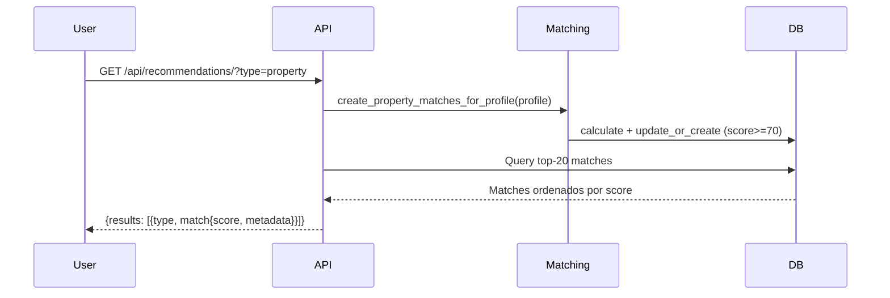
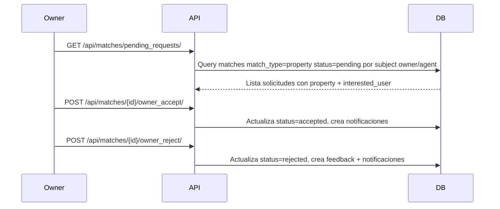

# 🎯 Sistema de Matching de Habitto — Documentación Técnica

## Visión General
- Conecta automáticamente usuarios con `properties`, `roommates` y `agents` según preferencias y compatibilidad.
- Tipos de match: `property`, `roommate`, `agent` (matching/models.py:60).
- Persistencia y estado: cada `Match` almacena `score` (0–100), `metadata` y `status` (`pending|accepted|rejected`) con índices para consulta eficiente (matching/models.py:69–80).

## Proceso End-to-End
- Creación de `SearchProfile` por el usuario con ubicación opcional y preferencias (matching/models.py:6–39).
- Generación de matches on-demand cuando se consultan recomendaciones (`/api/recommendations/`) o matches del perfil (`/api/search_profiles/{id}/matches/`) (matching/views.py:253–277, 49–73).
- Generación automática al crear una propiedad: se evalúan perfiles existentes y se persisten matches si `score >= 70` (property/views.py:82–101).
- Almacenamiento: `update_or_create` evita duplicados y solo persiste si `score >= 70` (utils/matching.py:201–208).
- Ordenamiento: matches se listan por `score` descendente (matching/views.py:63–73).
- Interacción del usuario: acciones `like`, `accept`, `reject` modifican el estado y generan notificaciones/mensajes (matching/views.py:118–227).
- Like directo sobre propiedad: permite crear/actualizar el `Match` y registrar `MatchFeedback` aunque no exista previamente (property/views.py:367–391).
- Regla de auto-aceptación: si `score >= 95` y `owner_prefs_score >= 90`, el `like` convierte el match a `accepted` (matching/views.py:148–165).

```mermaid
flowchart LR
    A[Crear SearchProfile] --> B{Trigger generación}
    B -->|GET /api/recommendations| C[create_*_matches_for_profile]
    B -->|GET /api/search_profiles/{id}/matches| C
    B -->|POST Property| C
    C --> D[calculate_*_match_score]
    D --> E{score >= 70?}
    E -->|No| F[Descartar]
    E -->|Sí| G[update_or_create Match]
    G --> H[Listado ordenado por score]
    H --> I[Acciones: like/accept/reject]
    I --> J{Auto-aceptación}
    J -->|Cumple| K[status=accepted + notificaciones]
    J -->|No| L[status según acción]
```

## Algoritmos y Lógica de Negocio

### Propiedades
- Cálculo principal: `calculate_property_match_score(search_profile, property)` retorna `(score, metadata)` (utils/matching.py:12–145).
- Factores y pesos actuales:
  - `location` 26%: distancia geodésica aproximada; `location_score = max(0, 100 - (distance_km*10))` y `50` si falta ubicación (utils/matching.py:13–23).
  - `price` 24%: 100 si dentro del rango; penalización proporcional si excede; soporte por persona si `allows_roommates` y `max_occupancy` (utils/matching.py:24–40).
  - `amenities` 13%: proporción de amenidades deseadas presentes; `100` si no se especifican amenidades (utils/matching.py:41–49).
  - `roommate/vibes` 10%: compatibilidad de roommate y etiquetas (`tags`) vs `vibes` del perfil (utils/matching.py:50–56).
  - `reputation` 8%: promedio de reseñas × 20; `80` por defecto si no hay datos (utils/matching.py:57–62).
  - `freshness` 5%: penalización por días desde `created_at` (`max(0, 100 - days*2)`) (utils/matching.py:63–65).
  - `family` 5%: suficiencia de dormitorios dado `children_count` (utils/matching.py:66–73).
  - `owner_prefs` 9%: preferencias del propietario vs atributos del perfil (género, niños, mascotas, fumador, estudiantes, empleo estable) con deducciones acumulativas y piso en `0` (utils/matching.py:75–101).
- Engagement boost: +3 si la propiedad está en `favorites` del `UserProfile` (utils/matching.py:103–111).
- `metadata.details` incluye los sub-scores y `owner_prefs_score` para auditoría (utils/matching.py:133–144).
- Actualiza `zone.match_activity_score` proporcional al score en matches de propiedad (utils/matching.py:209–218, 215–216).

### Roommates
- `calculate_roommate_match_score(profile1, profile2)`: solapamiento de zonas, presupuesto y preferencias/vibes con pesos 40/30/30 (utils/matching.py:147–181).
- `subject_id` del match usa el `id` del otro `SearchProfile` (utils/matching.py:233–239).

### Agentes
- `calculate_agent_match_score(profile, agent)`: heurística por comisión, verificación de agente y solapamiento de zonas (utils/matching.py:184–199).

## Entradas y Salidas

### Creación/actualización de SearchProfile
- Endpoint: `POST/PUT /api/search_profiles/`.
- Campos especiales: `latitude` y `longitude` se convierten a `location` (PointField) en el servidor (matching/serializers.py:41–75).
- Amenidades aceptan IDs o nombres; se normalizan mediante `AmenityFlexibleField` (matching/serializers.py:7–38).
- Ejemplo:
```http
POST /api/search_profiles/
{
  "budget_min": "800.00",
  "budget_max": "1500.00",
  "desired_types": ["casa", "departamento"],
  "bedrooms_min": 2,
  "bedrooms_max": 3,
  "latitude": "-16.500000",
  "longitude": "-68.150000",
  "amenities": [1, "Piscina"],
  "roommate_preference": "open",
  "age": 28,
  "children_count": 0,
  "stable_job": true
}
```

### Creación de Propiedades (amenidades flexibles)
- Endpoint: `POST /api/properties/`.
- Acepta `amenities` como IDs o nombres; si envías un nombre y no existe, se crea automáticamente.
- Conversión de `latitude`/`longitude` a `location` y opcional `zone_id`.
- Ejemplo:
```http
POST /api/properties/
{
  "type": "departamento",
  "address": "Av. Siempre Viva 123",
  "latitude": -16.500000,
  "longitude": -68.150000,
  "price": "1200.00",
  "bedrooms": 3,
  "amenities": [1, "Piscina", "Gimnasio"],
  "allows_roommates": true,
  "max_occupancy": 3,
  "preferred_tenant_gender": "any"
}
```
- Actualización de amenidades también acepta IDs o nombres vía `PUT/PATCH /api/properties/{id}/`.

### Consultar matches
- Endpoint: `GET /api/search_profiles/{id}/matches/?type=property|roommate|agent&status=pending|accepted|rejected`.
- Genera/actualiza antes de listar y ordena por `score` descendente (matching/views.py:49–73).

### Recomendaciones
- Endpoint: `GET /api/recommendations/?type=mixed|property|roommate|agent`.
- Devuelve hasta 20 por tipo con `match` serializado y `metadata.details` (matching/views.py:259–275).

### Interacciones con matches
- `POST /api/matches/{id}/like/`: registra feedback, notifica y puede auto-aceptar (matching/views.py:118–170).
- `POST /api/matches/{id}/accept/`: cambia estado a `accepted`, notifica y crea mensaje (matching/views.py:172–207).
- `POST /api/matches/{id}/reject/`: cambia estado a `rejected` y crea `MatchFeedback` con razón opcional (matching/views.py:209–227).
 - `POST /api/properties/{id}/like/`: crea/actualiza `Match` aún si no existía y registra `MatchFeedback`; notifica y abre chat (property/views.py:367–391).
 - `POST /api/properties/{id}/reject/`: crea/actualiza `Match` y lo marca `rejected`; registra `MatchFeedback` (property/views.py:393–405).

 Propietario/Agente:
 - `GET /api/matches/pending_requests/`: lista solicitudes de match pendientes para propiedades del usuario (matching/views.py:274–307).
 - `POST /api/matches/{id}/owner_accept/`: acepta solicitud pendiente (matching/views.py:309–329).
 - `POST /api/matches/{id}/owner_reject/`: rechaza solicitud y registra feedback (matching/views.py:331–354).

### Control de favoritos, vistos y re-vistos
- Favoritos: `POST /api/profiles/add_favorite/` y `POST /api/profiles/remove_favorite/` (user/views.py:183–219).
- Vistos por interacción de match: `GET /api/properties/seen/` retorna IDs con algún `Match` (property/views.py:344–352).
- Registro de vistas cada vez que el usuario ve una propiedad:
  - Automático al `GET /api/properties/{id}/` si el usuario está autenticado.
  - Manual: `POST /api/properties/{id}/view/`.
- Consulta: `GET /api/properties/views/` devuelve conteos y última vista por propiedad.
 - Eventos de re‑vista: cada visualización se registra en `PropertyViewEvent` para mantener histórico de interacciones (property/models.py:131–138).

### Listado de propiedades con score
- `GET /api/properties/?match_score=80&order_by_match=true`: aplica cálculo por `SearchProfile` del usuario, filtra y ordena por `_match_score` (property/views.py:102–141).

### Favoritos y vistos
- Favoritos: boost +3 en score al estar en `UserProfile.favorites`.
- Vistos: `GET /api/properties/seen/` retorna IDs con algún `Match` del usuario (property/views.py:344–352).

## Casos de Uso y Escenarios
- Descubrir propiedades cercanas y compatibles con filtros avanzados.
- Swipe de matches por tipo: `property`, `roommate`, `agent`.
- Flujo de like con auto-aceptación en alta compatibilidad.
- Roommate matching según zonas y presupuesto compartido.
- Ordenar listados por compatibilidad sin abandonar vistas de catálogo.
- Seguimiento de interacción: rechazos, likes, favoritos, vistos y re-vistos.

## Sistema de Chats
- Modelo: `Message` con `sender`, `receiver`, `content`, `is_read`, borrado por lado, edición (message/models.py:4–14).
- Endpoints principales:
  - `GET /api/messages/conversations/?include_messages=true&messages_page=1&messages_page_size=50`: conversaciones con último mensaje, contador de no leídos y hilo opcional paginado.
  - `GET /api/messages/thread/?other_user_id={id}`: hilo completo con otro usuario.
  - `POST /api/messages/`: crear mensaje `{ sender, receiver, content }`.
  - `POST /api/messages/{id}/mark_read/`: marcar un mensaje como leído.
  - `POST /api/messages/mark_thread_read/ { other_user_id }`: marcar toda la conversación como leída.
  - `POST /api/messages/clear_conversation/ { other_user_id }`: borrar conversación del lado del usuario (soft delete por lado).
- Integración con matching: al `like` y `accept` en matches de propiedad se genera un mensaje iniciando la conversación y se crean notificaciones (matching/views.py:136–165, 187–203).

## Requisitos y Dependencias Técnicas
- Framework: Django + Django REST Framework.
- Autenticación: JWT (`rest_framework_simplejwt`).
- GIS: GeoDjango y base de datos con soporte espacial (p.ej., PostGIS) para `PointField` y consultas de distancia.
- Apps relacionadas: `zone`, `amenity`, `review`, `notification`, `message`.
- Índices: `Match` tiene índices por `match_type`, `subject_id`, `status` (matching/models.py:74–80).
- Serialización: `SearchProfileSerializer`, `MatchSerializer`, etc. (matching/serializers.py).
- Umbral de persistencia configurable: `MATCH_MIN_SCORE` en settings o por entorno. Útil para pruebas (`0` lista todas las propiedades con match y recomendaciones sin filtrar).

## Diagramas de Flujo

### Generación y consumo de matches


### Like y auto-aceptación
```mermaid
flowchart TD
  A[POST /api/matches/{id}/like/] --> B[Crear MatchFeedback]
  B --> C[Notificar propietario]
  C --> D[Recalcular score y owner_prefs]
  D --> E{score>=95 && owner_prefs>=90}
  E -->|Sí| F[status=accepted + 2 notificaciones]
  E -->|No| G[status permanece]
```

### Like directo y solicitud de match
```mermaid
flowchart TD
  A[POST /api/properties/{id}/like/] --> B[calculate_property_match_score]
  B --> C[update_or_create Match status=pending]
  C --> D[Crear MatchFeedback like]
  D --> E[Notificar propietario + crear mensaje]
```

### Aceptación/Rechazo por propietario/agente


## Especificación Técnica de Endpoints
### Resumen
- Listados por score: `GET /api/properties/?match_score=<num>&order_by_match=true`
- Recomendaciones: `GET /api/recommendations/?type=property|roommate|agent|mixed`
- Matches del perfil: `GET /api/search_profiles/{id}/matches/?type=...&status=...`
- Acciones de match (usuario): `POST /api/matches/{id}/like|accept|reject`
- Like/Reject directo sobre propiedad: `POST /api/properties/{id}/like|reject`
- Solicitudes pendientes (propietario/agente): `GET /api/matches/pending_requests/`
- Decisión de propietario/agente: `POST /api/matches/{id}/owner_accept|owner_reject`
- Favoritos: `POST /api/profiles/add_favorite/`, `POST /api/profiles/remove_favorite/`
- Vistos: `GET /api/properties/seen/`, `POST /api/properties/{id}/view/`, `GET /api/properties/views/`

### Detalle y ejemplos
- `GET /api/properties/?match_score=80&order_by_match=true`
  - 200 OK: lista paginada con `_match_score` y orden por compatibilidad
  - 401 Unauthorized si no hay usuario para cálculo de score

- `POST /api/matches/{id}/like/`
  - Body opcional: `{ "reason": "string" }`
  - 200 OK: `{ status, match }`
  - 403 si el `match.target_user != requester`
  - Side effects: mensaje + notificaciones; auto‑aceptación si aplica

- `POST /api/properties/{id}/like/`
  - 200 OK: `{ status: "pending", match_id, score }`
  - Crea/actualiza `Match` aunque no existiera; registra `MatchFeedback`.
  - Side effects: mensaje al propietario + notificación.

- `POST /api/properties/{id}/reject/`
  - 200 OK: `{ status: "rejected", match_id }`
  - Crea/actualiza `Match` y lo marca como `rejected`; registra `MatchFeedback`.

- `GET /api/matches/pending_requests/`
  - 200 OK: lista de `{ match, property{...}, interested_user{...} }`
  - Filtra por propiedades del owner/agent autenticado.

- `POST /api/matches/{id}/owner_accept/`
  - 200 OK: `{ status: "accepted", match }`
  - 403 si el solicitante no es owner/agent de la propiedad

- `POST /api/matches/{id}/owner_reject/`
  - Body opcional: `{ "reason": "string" }`
  - 200 OK: `{ status: "rejected", match }`
  - Registra `MatchFeedback` del lado del propietario/agente

### Códigos de estado y errores
- 200 OK: operación exitosa
- 201 Created: creación de recursos (p.ej. mensajes)
- 400 Bad Request: parámetros inválidos o faltantes
- 401 Unauthorized: requiere autenticación
- 403 Forbidden: usuario no autorizado para la acción
- 404 Not Found: recurso inexistente

## Rendimiento y Limitaciones
- Límites de candidatos: 500 propiedades/roommates y 200 agentes por generación para evitar cargas excesivas (utils/matching.py:228–236, 241–245).
- Distancia geodésica aproximada: el cálculo usa `distance * 100` y una penalización lineal; ajustar si se requiere precisión geográfica (utils/matching.py:16–21).
- Umbral de persistencia: solo `score >= 70` se almacena; bajar/elevar modifica volumen y calidad (utils/matching.py:201–208).
- Regeneración on-demand: las consultas de matches y recomendaciones recalculan; considerar caching adicional si el tráfico crece (matching/views.py:49–61, 253–275).
- Costo de ordenamiento por match en listados: cada propiedad visible puede recalcularse; el endpoint limita y ordena para mitigar (property/views.py:114–141, 191–198).
- Dependencia de datos: reputación requiere `reviews`; si faltan datos, se aplican valores por defecto que pueden sesgar el score.

## Ejemplos Prácticos
```http
# Recomendaciones mixtas
GET /api/recommendations/?type=mixed

# Matches pendientes de propiedades del perfil 1
GET /api/search_profiles/1/matches/?type=property&status=pending

# Like y auto-aceptación potencial
POST /api/matches/123/like/
{ "reason": "Excelente ubicación" }

# Listado de propiedades ordenado por compatibilidad
GET /api/properties/?match_score=85&order_by_match=true

# Like directo sobre una propiedad
POST /api/properties/45/like/
{ "reason": "Me encanta la zona" }

# Rechazar una propiedad sin match previo
POST /api/properties/45/reject/
{ "reason": "Muy lejos" }

# Solicitudes de match pendientes para propietario/agente
GET /api/matches/pending_requests/

# Aceptar/Rechazar una solicitud de match por propietario/agente
POST /api/matches/123/owner_accept/
POST /api/matches/123/owner_reject/
{ "reason": "Preferimos no alquilar a fumadores" }
```

## Referencias de Código
- `utils/matching.py`: cálculo de score y generación (_calculate_* y _store_match) — utils/matching.py:12–145, 201–245.
- `matching/views.py`: endpoints `matches`, `recommendations`, `like/accept/reject` — matching/views.py:49–73, 118–227, 247–277.
- `property/views.py`: generación en `perform_create`, listado con `_match_score`, `seen` — property/views.py:82–141, 344–352.
- `matching/models.py`: `SearchProfile`, `Match`, `MatchFeedback` — matching/models.py:6–39, 59–93.
- `matching/serializers.py`: normalización de amenidades y lat/lng — matching/serializers.py:7–38, 41–75.

## Resumen Ejecutivo
- Captura preferencias en `SearchProfile` y calcula compatibilidad multi-factor.
- Persiste y ordena matches de alta calidad; soporta interacción con notificaciones y mensajería.
- Diseñado para escalabilidad moderada con límites, índices y regeneración on-demand.

