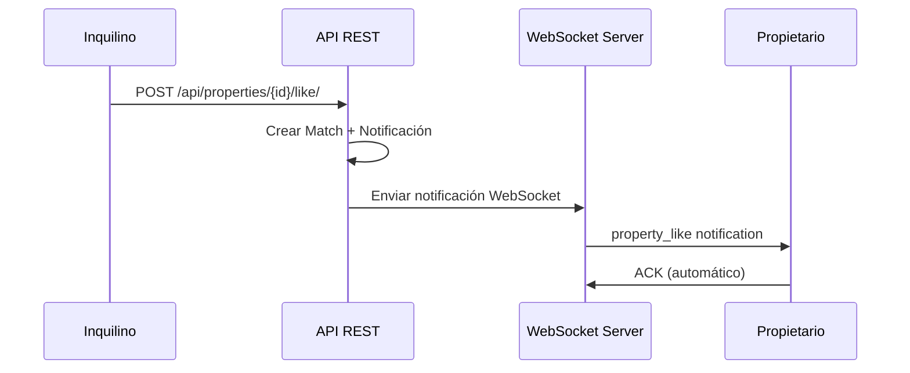
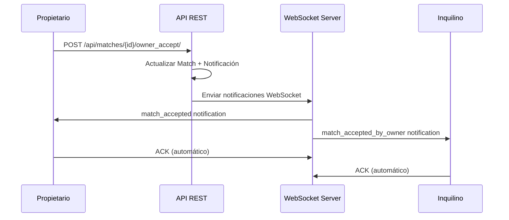

# 🚀 Sistema de Notificaciones en Tiempo Real - WebSocket API

## 📋 Descripción General

El sistema de notificaciones en tiempo real de Habitto utiliza WebSockets para proporcionar actualizaciones instantáneas sobre eventos importantes del sistema de matching. Las notificaciones se envían a través de canales dedicados para propietarios y inquilinos.

## 🔗 Endpoints de WebSocket

### 1. Notificaciones de Propiedades
**URL:** `ws://localhost:8000/ws/property-notifications/{user_id}/`

**Autenticación:** Requiere token JWT en query params o headers

**Parámetros de URL:**
- `user_id`: ID del usuario (debe coincidir con el usuario autenticado)

**Parámetros de Conexión:**
- `token`: JWT token (opcional en query string)
- `Authorization: Bearer {token}`: Header de autorización (opcional)

**Ejemplo de Conexión:**
```javascript
const socket = new WebSocket(`ws://localhost:8000/ws/property-notifications/${userId}/?token=${jwtToken}`);
```

### 2. Notificaciones de Inquilinos
**URL:** `ws://localhost:8000/ws/tenant-notifications/{user_id}/`

**Autenticación:** Igual que el endpoint de propiedades

## 📨 Tipos de Mensajes

### Mensajes del Servidor al Cliente

#### 1. Conexión Establecida
```json
{
  "type": "connection_established",
  "message": "Conectado a notificaciones de propiedades",
  "timestamp": "2024-01-15T10:30:00.000Z"
}
```

#### 2. Notificación de Like en Propiedad
```json
{
  "type": "property_like",
  "property_id": 123,
  "property_title": "departamento en Av. Siempre Viva 123",
  "interested_user": {
    "id": 456,
    "username": "juan_perez",
    "email": "juan@example.com",
    "first_name": "Juan",
    "last_name": "Perez",
    "phone": "+1234567890",
    "user_type": "inquilino"
  },
  "timestamp": "2024-01-15T10:30:00.000Z",
  "notification_id": "550e8400-e29b-41d4-a716-446655440000"
}
```

#### 3. Notificación de Match Aceptado (Propietario)
```json
{
  "type": "match_accepted",
  "property_id": 123,
  "property_title": "departamento en Av. Siempre Viva 123",
  "property_address": "Av. Siempre Viva 123",
  "owner_contact": {
    "email": "owner@example.com",
    "phone": "+1234567890"
  },
  "tenant_user": {
    "id": 456,
    "username": "juan_perez",
    "full_name": "Juan Pérez",
    "profile_picture": "https://.../media/profile_pictures/user_456_....jpg"
  },
  "match_status": "accepted",
  "next_steps": [
    "Contactar al inquilino para coordinar visita",
    "Verificar documentación",
    "Coordinar firma de contrato"
  ],
  "timestamp": "2024-01-15T10:30:00.000Z",
  "notification_id": "660e8400-e29b-41d4-a716-446655440000"
}
```

#### 4. Notificación de Match Aceptado (Inquilino)
```json
{
  "type": "match_accepted_by_owner",
  "property_id": 123,
  "property_title": "departamento en Av. Siempre Viva 123",
  "property_address": "Av. Siempre Viva 123",
  "owner_name": "María García",
  "owner_contact": {
    "email": "owner@example.com",
    "phone": "+1234567890"
  },
  "match_score": 85.5,
  "next_steps": [
    "Contactar al propietario para coordinar visita",
    "Preparar documentación necesaria",
    "Coordinar fecha de mudanza"
  ],
  "timestamp": "2024-01-15T10:30:00.000Z",
  "notification_id": "770e8400-e29b-41d4-a716-446655440000"
}
```

#### 5. Pong (Respuesta a Ping)
```json
{
  "type": "pong",
  "timestamp": "2024-01-15T10:30:00.000Z"
}
```

#### 6. Error
```json
{
  "type": "error",
  "message": "JSON inválido"
}
```

### Mensajes del Cliente al Servidor

#### 1. Ping (Keep Alive)
```json
{
  "type": "ping"
}
```

#### 2. Marcar Notificación como Leída
```json
{
  "type": "mark_read",
  "notification_id": "550e8400-e29b-41d4-a716-446655440000"
}
```

## 🔄 Flujo de Eventos

### 1. Notificación de Like en Propiedad

```mermaid
sequenceDiagram
    participant Tenant as Inquilino
    participant API as API REST
    participant WS as WebSocket Server
    participant Owner as Propietario

    Tenant->>API: POST /api/properties/{id}/like/
    API->>API: Crear Match + Notificación
    API->>WS: Enviar notificación WebSocket
    WS->>Owner: property_like notification
    Owner->>WS: ACK (automático)
```

### 2. Notificación de Match Aceptado

```mermaid
sequenceDiagram
    participant Owner as Propietario
    participant API as API REST
    participant WS as WebSocket Server
    participant Tenant as Inquilino

    Owner->>API: POST /api/matches/{id}/owner_accept/
    API->>API: Actualizar Match + Notificación
    API->>WS: Enviar notificaciones WebSocket
    WS->>Owner: match_accepted notification
    WS->>Tenant: match_accepted_by_owner notification
    Owner->>WS: ACK (automático)
    Tenant->>WS: ACK (automático)
```

## 🔐 Seguridad

### Autenticación
- **JWT Token**: Se requiere un token JWT válido para establecer conexión
- **User Verification**: El usuario solo puede conectarse a su propio canal
- **Token Expiration**: Los tokens expiran según la configuración del sistema

### Autorización
- **Channel Access**: Cada usuario solo puede acceder a sus canales de notificación
- **Message Validation**: Todos los mensajes se validan antes de procesarse
- **Rate Limiting**: Implementación de límites para prevenir abuso

## 🧪 Ejemplos de Implementación

### JavaScript/Frontend
```javascript
class HabittoWebSocketClient {
    constructor(userId, token) {
        this.userId = userId;
        this.token = token;
        this.socket = null;
        this.reconnectInterval = 5000;
    }

    connect() {
        const url = `ws://localhost:8000/ws/property-notifications/${this.userId}/?token=${this.token}`;
        this.socket = new WebSocket(url);

        this.socket.onopen = (event) => {
            console.log('Conectado a notificaciones');
            this.startPingInterval();
        };

        this.socket.onmessage = (event) => {
            const data = JSON.parse(event.data);
            this.handleMessage(data);
        };

        this.socket.onclose = (event) => {
            console.log('Desconectado de notificaciones');
            this.stopPingInterval();
            setTimeout(() => this.connect(), this.reconnectInterval);
        };

        this.socket.onerror = (error) => {
            console.error('Error de WebSocket:', error);
        };
    }

    handleMessage(data) {
        switch(data.type) {
            case 'property_like':
                this.showPropertyLikeNotification(data);
                break;
            case 'match_accepted':
                this.showMatchAcceptedNotification(data); // incluye tenant_user para mostrar tarjeta de usuario
                break;
            case 'match_accepted_by_owner':
                this.showMatchAcceptedByOwnerNotification(data);
                break;
            case 'pong':
                // Respuesta a ping, ignorar
                break;
            case 'error':
                console.error('Error del servidor:', data.message);
                break;
        }
    }

    showPropertyLikeNotification(data) {
        const notification = {
            title: '¡Nuevo interesado en tu propiedad!',
            body: `${data.interested_user.first_name} ${data.interested_user.last_name} está interesado en tu propiedad`,
            data: data
        };

        // Mostrar notificación en UI o usar Web Push API
        this.displayNotification(notification);
    }

    showMatchAcceptedNotification(data) {
        const notification = {
            title: '¡Match Aceptado!',
            body: `Match con ${data.tenant_user?.full_name || 'inquilino'}`,
            data: data
        };

        this.displayNotification(notification);
    }

    showMatchAcceptedByOwnerNotification(data) {
        const notification = {
            title: '¡Tu solicitud fue aceptada!',
            body: `El propietario ${data.owner_name} aceptó tu solicitud para ${data.property_title}`,
            data: data
        };

        this.displayNotification(notification);
    }

    displayNotification(notification) {
        // Implementar lógica de visualización de notificaciones
        console.log('Notificación:', notification);

        // Ejemplo con Web Push API
        if ('Notification' in window && Notification.permission === 'granted') {
            new Notification(notification.title, {
                body: notification.body,
                data: notification.data
            });
        }
    }

    startPingInterval() {
        this.pingInterval = setInterval(() => {
            if (this.socket.readyState === WebSocket.OPEN) {
                this.socket.send(JSON.stringify({ type: 'ping' }));
            }
        }, 30000); // Ping cada 30 segundos
    }

    stopPingInterval() {
        if (this.pingInterval) {
            clearInterval(this.pingInterval);
        }
    }

    disconnect() {
        if (this.socket) {
            this.socket.close();
        }
    }
}

// Uso
const client = new HabittoWebSocketClient(userId, jwtToken);
client.connect();
```

### React Hook
```javascript
import { useEffect, useState } from 'react';

const useHabittoWebSocket = (userId, token) => {
    const [socket, setSocket] = useState(null);
    const [notifications, setNotifications] = useState([]);
    const [isConnected, setIsConnected] = useState(false);

    useEffect(() => {
        if (!userId || !token) return;

        const ws = new WebSocket(`ws://localhost:8000/ws/property-notifications/${userId}/?token=${token}`);

        ws.onopen = () => {
            setIsConnected(true);
        };

        ws.onmessage = (event) => {
            const data = JSON.parse(event.data);

            if (data.type === 'property_like' ||
                data.type === 'match_accepted' ||
                data.type === 'match_accepted_by_owner') {
                setNotifications(prev => [...prev, data]);
            }
        };

        ws.onclose = () => {
            setIsConnected(false);
        };

        setSocket(ws);

        return () => {
            ws.close();
        };
    }, [userId, token]);

    const markAsRead = (notificationId) => {
        if (socket && socket.readyState === WebSocket.OPEN) {
            socket.send(JSON.stringify({
                type: 'mark_read',
                notification_id: notificationId
            }));
        }
    };

    return { notifications, isConnected, markAsRead };
};

export default useHabittoWebSocket;
```

## 📊 Monitoreo y Logging

### Registro de Eventos
El sistema registra automáticamente:
- Conexiones y desconexiones
- Envío de notificaciones
- Recepción de notificaciones
- Errores de WebSocket

### Métricas de Rendimiento
- Tiempo de conexión
- Latencia de notificaciones
- Tasa de éxito de entrega
- Uso de memoria y CPU

## 🔧 Configuración

### Variables de Entorno
```bash
# Redis para Channels (producción)
REDIS_HOST=127.0.0.1
REDIS_PORT=6379
CHANNEL_LAYER=redis

# Memoria (desarrollo)
CHANNEL_LAYER=inmemory
```

### Settings Django
```python
# Configuración de Channels
CHANNEL_LAYERS = {
    'default': {
        'BACKEND': 'channels_redis.core.RedisChannelLayer',
        'CONFIG': {
            "hosts": [(os.environ.get('REDIS_HOST', '127.0.0.1'), int(os.environ.get('REDIS_PORT', '6379')))],
        },
    },
}

ASGI_APPLICATION = 'bk_habitto.asgi.application'
```

## 🚨 Manejo de Errores

### Errores de Conexión
- **Código 1000**: Cierre normal
- **Código 1006**: Conexión perdida (reconectar automáticamente)
- **Código 1002**: Protocolo inválido
- **Código 1003**: Tipo de datos no soportado

### Errores de Autenticación
- **401**: Token inválido o expirado
- **403**: Acceso no autorizado al canal

### Errores de Aplicación
- JSON inválido: Mensaje de error inmediato
- Datos faltantes: Notificación parcial o error
- Timeout: Reintento automático

## 📚 Referencias

- [Django Channels Documentation](https://channels.readthedocs.io/)
- [WebSocket API - MDN](https://developer.mozilla.org/en-US/docs/Web/API/WebSocket)
- [JWT Authentication](https://jwt.io/)
- [Real-time Web Applications](https://developer.mozilla.org/en-US/docs/Web/Guide/AJAX/Getting_Started)
